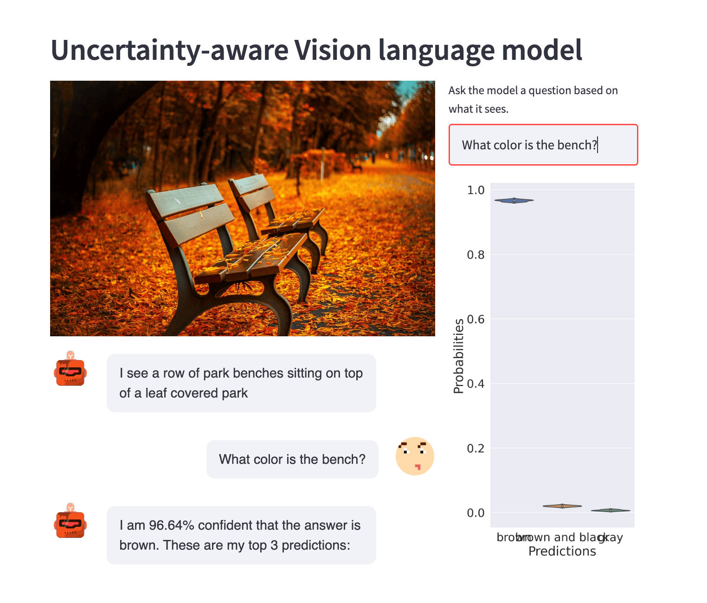

# Towards uncertainty-aware vision language models. (u-VLMo)

## Interface
Here is the sample interface for the app:

## Features
- **Quantifies uncertainty of outputs from vision language models.**
- Uses multi-grained vision language model for inference. ([Multi-Grained Vision Language Pre-Training: Aligning Texts with Visual Concepts](https://arxiv.org/abs/2111.08276). Yan Zeng, Xinsong Zhang, Hang Li. arXiv 2021.)
- Uses state of the art transformers for vision and text encoding/ decoding. 
    - vision encoder: SWIN Transformer. (Suitable for object detection)
    - text encoder + decoder: BERT
- Supports inference on GPU if available.
- Pretrained checkpoints (**Credits to XVLM authors for open sourcing the models**):
  - Captioning: ```coco_capt_ft_epoch_4.th``` [[Download](https://drive.google.com/drive/folders/15Ymsay477QKo3PWOt9cwjWpiII5RQaH8)]
  - VQA: ```model_state_epoch_9.th``` [[Download](https://drive.google.com/drive/folders/1tRKlCVMvkRquad7kMp4JVEbaKG-Ho8To)]


Please read the code for more details. 

## Requirements
- Install python3 environment
```
pip3 install -r requirements.txt
```
- Create a new folder called "checkpoints".
```
mkdir checkpoints
```
- Download pretrained model into the newly create folder.
- Run the application locally.
```
streamlit run app.py
```

- Streamlit typically starts the local app server on localhost:8501.

## Acknowledgement
The core model related codes and configurations are forked from the [github repo](https://github.com/zengyan-97/X-VLM) of original XVLM authors.